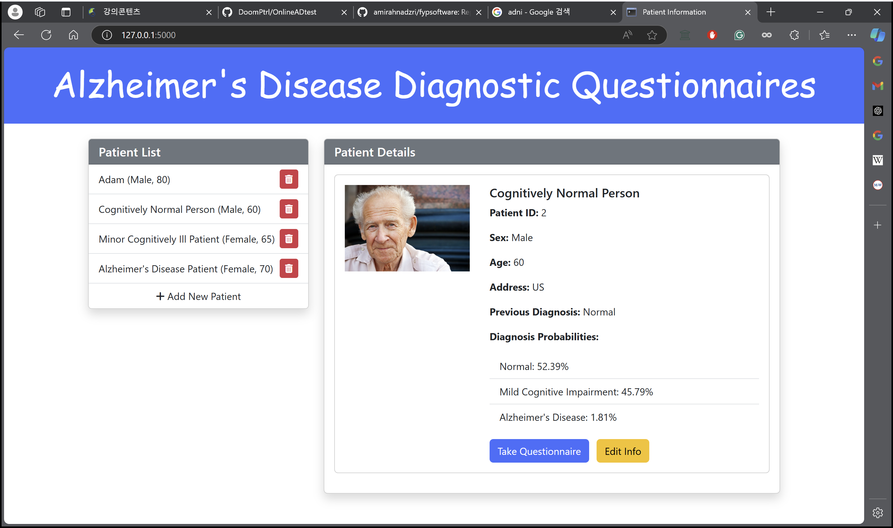
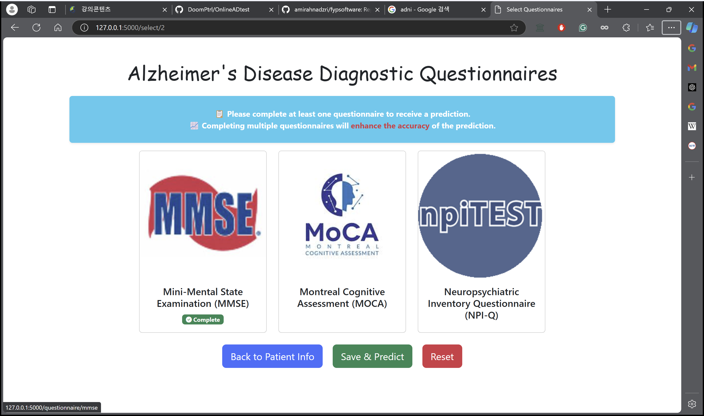
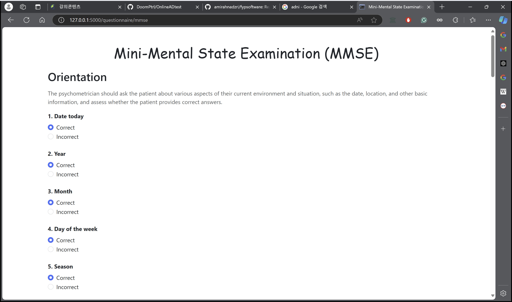
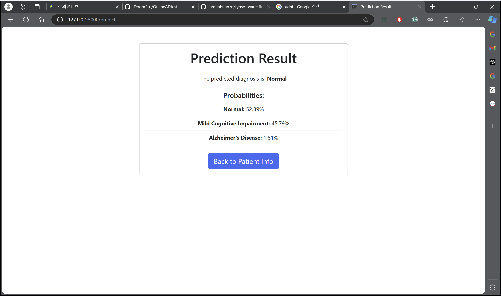

# Alzheimer's Disease Diagnostic Questionnaires Webapp

This is a webapp that 
1. predits diagnosis(AD/MCI/CN) based on the questionnaire answers.
2. manages patient's information and questionnaire answers.
This is the graduation project of Yeongyu Kim.
# Why this project?
Refer to my report!
https://1drv.ms/t/s!Ao2cfP9fepJck6l_VS48DmnCvps3rg?e=M0kpos
# Details
## Data Collection
- Three questionnaire data are used:
  1. Mini-Mental State Examination(MMSE)
  2. Montreal Cognitive Assessment(MoCA)
  3. Neuropsychiatric Inventory Questionnaire(NPI-Q)
- They are from [Alzheimer's Disease Neuroimaging Initiative()](https://adni.loni.usc.edu/).
- They are in /modeling/data.
- Qustionnaire details are in questionnaires_info.json.
## Developing AI model
### Preprocessing
- Preprocessing and EDA is done at /modeling/{questionnaire_name}.py to generate clean data.
- The distribution between diagnosis group is not distinct.
- The questionnaire data is from ADNI, so the data columns differs from the orignial questionnaire conventions.  
- Most questions are true/false except two questions in MoCA.
### Training model
- The random forest model, which is used for the webapp, is trained in /modeling/rf.py.
- For various model comparison, refer to best_accuracy.py.
- baysesian.py and pipline.py are left for future work to implement QDA.
## Developing the Webapp
- The webapp is developed using Flask.
- Html files are in /templates.
- patient data is stored in paitent_info.csv.
# Results

| Model Type   | MMSE Alone | MoCA Alone | NPIQ Alone | MMSE & MoCA | MMSE & NPIQ | MoCA & NPIQ | MMSE, MoCA & NPIQ |
|--------------|------------|------------|------------|-------------|-------------|-------------|--------------------|
| RF           | 67%        | 74%        | 59%        | 77%         | 72%         | 77%         | 79%                |
| SVM          | 66%        | 67%        | 57%        | 70%         | 71%         | 71%         | 74%                |
| Gradient Boosting   | 65%        | 68%        | 58%        | 69%         | 71%         | 71%         | 73%                |
| AdaBoost     | 66%        | 65%        | 56%        | 65%         | 69%         | 66%         | 65%                |
| ExtraTree    | 67%        | 72%        | 58%        | 75%         | 70%         | 75%         | 77%                |

# Future Work
- [ ] Implementing QDA model
- [ ] Implementing more questionnaire data
- [ ] Implementing more AI models
- [ ] Improving the webapp design
# Demo
https://www.youtube.com/watch?v=603yG2koSlI

